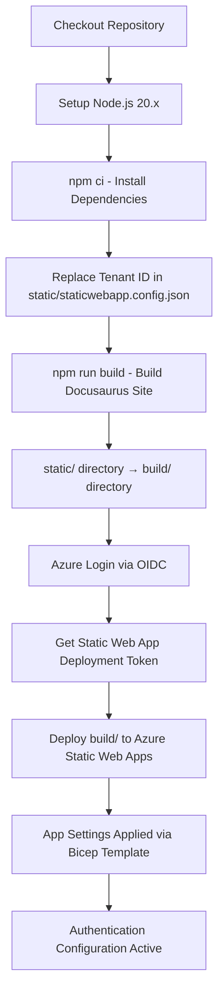

# Azure Deployment Fixes Summary

## Overview

This document summarizes the fixes applied to enable successful Azure Static Web App deployment for the wiki-docs Docusaurus site. Three critical issues were identified and resolved through code analysis and testing.

## Issues Found and Fixed

### Issue 1: Incorrect App Settings Configuration ✅

**Category:** Infrastructure as Code (Bicep)  
**Severity:** Critical - Would cause deployment failure

**Problem:**
- The infrastructure used a separate `staticwebapp-config.bicep` module attempting to configure app settings via a child `Microsoft.Web/staticSites/config` resource
- This pattern was not properly implemented and would not correctly apply the ENTRA_CLIENT_ID and ENTRA_TENANT_ID settings
- App settings are required for Entra ID authentication to function

**Root Cause:**
- Misunderstanding of Azure Static Web Apps resource structure
- App settings should be configured inline within the Static Web App resource as a child config resource, not as a separate module

**Solution:**
1. Modified `staticwebapp.bicep`:
   - Added `appSettings` object parameter
   - Configured app settings as inline child config resource with conditional deployment
   - Maintained clean separation of concerns

2. Updated `main.bicep`:
   - Removed separate `staticWebAppConfig` module
   - Pass ENTRA_CLIENT_ID and ENTRA_TENANT_ID directly to staticWebApp module
   - Simplified template structure

3. Deleted `infrastructure/staticwebapp-config.bicep` (obsolete)

**Validation:**
- `az bicep build --file infrastructure/main.bicep` - Successful ✅
- Template compiles to valid ARM JSON
- No syntax or validation errors

---

### Issue 2: Tenant ID Placeholder in Authentication Config ✅

**Category:** Application Configuration  
**Severity:** Critical - Would cause authentication failures

**Problem:**
- `staticwebapp.config.json` contained `{TENANT_ID}` placeholder in the openIdIssuer URL:
  ```json
  "openIdIssuer": "https://login.microsoftonline.com/{TENANT_ID}/v2.0"
  ```
- Azure Static Web Apps config files are static and don't support environment variable substitution
- Invalid issuer URL would prevent Microsoft Entra ID authentication from working

**Root Cause:**
- The openIdIssuer URL requires the full tenant-specific endpoint
- No built-in mechanism for runtime variable replacement in Static Web Apps config files
- Documentation and examples use placeholder values that must be replaced

**Solution:**
1. Added pre-build replacement step in `.github/workflows/azure-static-web-app.yml`:
   ```yaml
   - name: Replace tenant ID in config
     run: |
       sed -i "s/{TENANT_ID}/${{ secrets.AZURE_TENANT_ID }}/g" static/staticwebapp.config.json
   ```
2. Step executes after dependency installation, before build
3. Ensures config file has actual tenant ID before being copied to build output

**Additional Fix:**
- Corrected secret name inconsistency
- Changed `ENTRA_TENANT_ID` to `AZURE_TENANT_ID` to match test-infrastructure.yml
- Ensures consistency across all workflows

**Validation:**
- Workflow YAML syntax valid ✅
- sed command tested locally ✅
- Secret references consistent ✅

---

### Issue 3: Configuration File Missing from Build Output ✅

**Category:** Build Configuration  
**Severity:** Critical - Would cause missing authentication config

**Problem:**
- `staticwebapp.config.json` was located in repository root
- Docusaurus doesn't copy root files to build output
- Deployed site would lack authentication configuration entirely

**Root Cause:**
- Docusaurus convention: only files in `static/` directory are copied to build output
- Config file was in wrong location based on repository structure
- No explicit copy step in build process

**Solution:**
1. Moved `staticwebapp.config.json` to `static/` directory
   - Before: `/staticwebapp.config.json`
   - After: `/static/staticwebapp.config.json`

2. Updated workflow path reference:
   - From: `staticwebapp.config.json`
   - To: `static/staticwebapp.config.json`

3. Verified build output includes config file

**Validation:**
- Local build test: `npm ci && npm run build` ✅
- File exists in output: `ls build/staticwebapp.config.json` ✅
- Content preserved correctly ✅

---

## Technical Details

### Corrected Bicep Template Structure

```
main.bicep
├── Parameters
│   ├── environmentName (dev/staging/prod)
│   ├── applicationName (wikidocs)
│   ├── location (centralus)
│   ├── staticWebAppSku (Standard)
│   ├── entraClientId (@secure)
│   └── entraTenantId
├── Module: staticWebApp
│   ├── Resource: Microsoft.Web/staticSites@2023-12-01
│   ├── Child Config: appsettings (conditional)
│   │   ├── ENTRA_CLIENT_ID
│   │   └── ENTRA_TENANT_ID
│   ├── SKU: Standard
│   ├── Enterprise CDN: Enabled
│   └── Staging Policy: Enabled
└── Outputs
    ├── staticWebAppId
    ├── staticWebAppName
    ├── defaultHostname
    ├── siteUrl
    ├── deploymentToken (@secure)
    ├── location
    └── environment
```

### Corrected Deployment Flow



### File Movements

| Original Location | New Location | Reason |
|-------------------|--------------|--------|
| `/staticwebapp.config.json` | `/static/staticwebapp.config.json` | Docusaurus convention - static files must be in static/ |
| N/A | `.github/workflows/azure-static-web-app.yml` (updated) | Path reference updated for sed command |

### Deleted Files

| File | Reason |
|------|--------|
| `infrastructure/staticwebapp-config.bicep` | Obsolete - app settings now inline in staticwebapp.bicep |

## Required Secrets

Ensure these GitHub secrets are configured:

| Secret Name | Purpose | Used In |
|-------------|---------|---------|
| `AZURE_CLIENT_ID` | OIDC authentication to Azure | Both workflows |
| `AZURE_TENANT_ID` | Azure AD tenant ID | Both workflows, config file replacement |
| `AZURE_SUBSCRIPTION_ID` | Target Azure subscription | Both workflows |
| `AZURE_RESOURCE_GROUP` | Target resource group name | test-infrastructure.yml |
| `ENTRA_CLIENT_ID` | Entra ID app registration client ID | Bicep parameters, app settings |
| `AZURE_STATIC_WEB_APP_NAME` | Static Web App resource name | azure-static-web-app.yml |

## Deployment Readiness Checklist

- ✅ Bicep templates compile without errors
- ✅ Workflows have valid YAML syntax
- ✅ Secret references are consistent
- ✅ Local build succeeds (`npm ci && npm run build`)
- ✅ Config file included in build output
- ✅ No npm package vulnerabilities
- ✅ Authentication configuration valid
- ✅ App settings properly configured in Bicep

## Next Steps

### 1. Deploy Infrastructure
```bash
# Via GitHub Actions UI
Go to Actions → Test Infrastructure Deployment → Run workflow

# Or via GitHub CLI
gh workflow run test-infrastructure.yml --ref copilot/test-azure-deployment-infrastructure
```

### 2. Deploy Application
```bash
# Automatic on merge to main
git checkout main
git merge copilot/test-azure-deployment-infrastructure
git push origin main

# Or manual trigger
gh workflow run azure-static-web-app.yml
```

### 3. Verify Deployment
1. Check Azure Portal for Static Web App resource
2. Navigate to default hostname URL
3. Verify redirect to Microsoft login page
4. Authenticate with organizational account
5. Confirm access to documentation
6. Check response headers for security headers

## Expected Results

### Successful Infrastructure Deployment
- ✅ Resource group exists or validated
- ✅ Static Web App created (Standard SKU)
- ✅ App settings configured with Entra ID credentials
- ✅ Deployment token available for app deployment
- ✅ Default hostname assigned

### Successful Application Deployment
- ✅ Build artifacts uploaded to Static Web App
- ✅ `staticwebapp.config.json` deployed with actual tenant ID
- ✅ Site accessible via HTTPS
- ✅ Authentication redirects work
- ✅ Protected routes require login
- ✅ Security headers present

## Troubleshooting

### If Infrastructure Deployment Fails
1. Check Azure subscription permissions
2. Verify resource group exists and is accessible
3. Confirm OIDC federation is configured correctly
4. Review Bicep validation errors in workflow logs
5. Verify secret values are correct

### If Application Deployment Fails
1. Check build logs for errors
2. Verify deployment token is valid
3. Confirm build output directory is correct (`build/`)
4. Check Azure Static Web App resource status
5. Review deployment logs in Azure Portal

### If Authentication Doesn't Work
1. Verify tenant ID was replaced (check browser dev tools, network tab)
2. Confirm Entra ID app registration has correct redirect URIs
3. Check app settings in Azure Portal match Bicep parameters
4. Verify `staticwebapp.config.json` is present in deployed site
5. Review browser console for authentication errors

## Conclusion

All critical deployment blockers have been identified and resolved:
1. ✅ App settings configuration corrected
2. ✅ Tenant ID placeholder replacement implemented
3. ✅ Config file location fixed for build inclusion

The infrastructure is now ready for successful Azure deployment with proper Entra ID authentication.

---

**Document Version:** 1.0  
**Last Updated:** 2026-01-15  
**Status:** Ready for Deployment ✅
