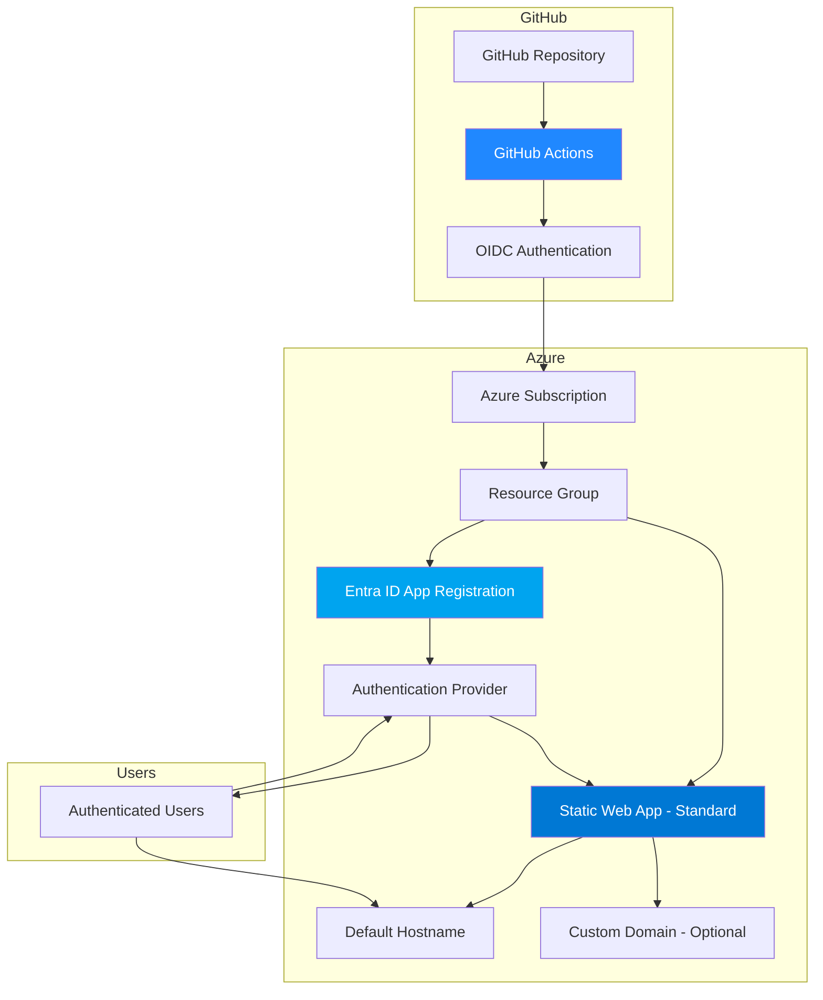

# Azure Static Web App Infrastructure

This directory contains the Infrastructure as Code (IaC) for deploying a Docusaurus documentation site to Azure Static Web Apps with Entra ID (Azure AD) authentication.

## 📋 Table of Contents

- [Architecture Overview](#architecture-overview)
- [Prerequisites](#prerequisites)
- [Quick Start](#quick-start)
- [Detailed Setup](#detailed-setup)
- [Configuration](#configuration)
- [Deployment](#deployment)
- [GitHub Actions](#github-actions)
- [Security](#security)
- [Troubleshooting](#troubleshooting)
- [Cost Estimation](#cost-estimation)

## 🏗️ Architecture Overview



### Components

1. **Azure Static Web App (Standard SKU)**
   - Hosts the Docusaurus documentation site
   - Provides global CDN distribution
   - Enterprise-grade features enabled
   - Automatic SSL/TLS certificates

2. **Entra ID App Registration**
   - Handles user authentication
   - Integrates with organizational identity
   - Provides single sign-on (SSO)

3. **GitHub Actions Workflow**
   - Automated CI/CD pipeline
   - OIDC authentication (no secrets needed)
   - Pull request preview environments

## 📦 Prerequisites

### Required Tools

- **Azure CLI** (version 2.50.0 or higher)
  ```bash
  az --version
  az upgrade
  ```

- **PowerShell 7+** (for Entra ID setup)
  ```bash
  pwsh --version
  ```

- **Azure PowerShell Modules**
  ```powershell
  Install-Module -Name Az.Accounts -Scope CurrentUser
  Install-Module -Name Az.Resources -Scope CurrentUser
  ```

- **Bicep CLI** (usually bundled with Azure CLI)
  ```bash
  az bicep version
  az bicep upgrade
  ```

### Required Permissions

- **Azure Subscription**: Contributor or Owner role
- **Azure AD**: Application Administrator or Global Administrator role (for app registration)
- **GitHub Repository**: Admin access (for configuring secrets and variables)

### Azure Subscription Setup

1. **Login to Azure**
   ```bash
   az login
   ```

2. **Set Active Subscription**
   ```bash
   az account list --output table
   az account set --subscription "<subscription-id>"
   ```

3. **Create Resource Group** (if not exists)
   ```bash
   az group create \
     --name "rg-wikidocs-prod" \
     --location "centralus" \
     --tags "Environment=Production" "Application=WikiDocs" "ManagedBy=Bicep"
   ```

## 🚀 Quick Start

### Step 1: Create Entra ID App Registration

Run the PowerShell setup script to create the Entra ID app registration:

```powershell
cd infrastructure/scripts
pwsh ./setup-entra-app.ps1
```

The script will:
- Create the Entra ID app registration
- Configure redirect URIs
- Set up required API permissions
- Export configuration to `entra-app-config.json`

**Save the output values:**
- `Client ID` (Application ID)
- `Tenant ID`
- `Object ID`

### Step 2: Configure GitHub

Set up the following GitHub repository variables (Settings → Secrets and variables → Actions → Variables):

```bash
AZURE_CLIENT_ID=<from OIDC setup>
AZURE_TENANT_ID=<your-tenant-id>
AZURE_SUBSCRIPTION_ID=<your-subscription-id>
AZURE_RESOURCE_GROUP=rg-wikidocs-prod
AZURE_STATIC_WEB_APP_NAME=<will-be-created-during-deployment>
ENTRA_CLIENT_ID=<from-entra-app-setup>
```

> **Note**: The `AZURE_CLIENT_ID` is for OIDC authentication (GitHub to Azure), while `ENTRA_CLIENT_ID` is for user authentication (users to Static Web App).

### Step 3: Deploy Infrastructure

Deploy the Bicep template:

```bash
cd infrastructure

# Option 1: Using parameters file
az deployment group create \
  --resource-group "rg-wikidocs-prod" \
  --template-file main.bicep \
  --parameters parameters.json \
  --parameters entraClientId='<entra-client-id>' \
  --parameters entraTenantId='<tenant-id>'

# Option 2: Using inline parameters
az deployment group create \
  --resource-group "rg-wikidocs-prod" \
  --template-file main.bicep \
  --parameters environmentName=prod \
  --parameters applicationName=wikidocs \
  --parameters location=centralus \
  --parameters staticWebAppSku=Standard \
  --parameters entraClientId='<entra-client-id>' \
  --parameters entraTenantId='<tenant-id>'
```

**Capture the outputs:**
```bash
# Get deployment outputs
az deployment group show \
  --resource-group "rg-wikidocs-prod" \
  --name main \
  --query "properties.outputs" \
  --output json
```

### Step 4: Update GitHub Variables

Update the `AZURE_STATIC_WEB_APP_NAME` variable with the deployed Static Web App name from the deployment outputs.

### Step 5: Update Entra ID Redirect URI

After deployment, update the Entra ID app registration with the actual Static Web App hostname:

```bash
# Get the hostname
HOSTNAME=$(az staticwebapp show \
  --name "<static-web-app-name>" \
  --resource-group "rg-wikidocs-prod" \
  --query "defaultHostname" \
  --output tsv)

# Update redirect URI
az ad app update \
  --id "<entra-client-id>" \
  --web-redirect-uris "https://${HOSTNAME}/.auth/login/aad/callback"
```

### Step 6: Deploy Application

Push to the `main` branch or manually trigger the GitHub Actions workflow:

```bash
git push origin main
```

Or use workflow dispatch:
```bash
gh workflow run azure-static-web-app.yml
```

## 📝 Detailed Setup

### Infrastructure Configuration

#### Parameters File

Edit `infrastructure/parameters.json` to customize your deployment:

```json
{
  "$schema": "https://schema.management.azure.com/schemas/2019-04-01/deploymentParameters.json#",
  "contentVersion": "1.0.0.0",
  "parameters": {
    "environmentName": {
      "value": "prod"
    },
    "applicationName": {
      "value": "wikidocs"
    },
    "location": {
      "value": "centralus"
    },
    "staticWebAppSku": {
      "value": "Standard"
    },
    "entraClientId": {
      "value": "00000000-0000-0000-0000-000000000000"
    },
    "entraTenantId": {
      "value": "00000000-0000-0000-0000-000000000000"
    },
    "tags": {
      "value": {
        "CostCenter": "Engineering",
        "Owner": "DevOps Team",
        "Project": "Wiki Documentation"
      }
    }
  }
}
```

#### Resource Naming Convention

Resources follow Azure naming best practices:

| Resource Type | Naming Pattern | Example |
|---------------|----------------|---------|
| Static Web App | `stapp-{app}-{env}-{unique}` | `stapp-wikidocs-prod-abc123` |
| Resource Group | `rg-{app}-{env}` | `rg-wikidocs-prod` |

### Static Web App Configuration

The `staticwebapp.config.json` file in the repository root configures:

#### Authentication

```json
{
  "auth": {
    "identityProviders": {
      "azureActiveDirectory": {
        "registration": {
          "openIdIssuer": "https://login.microsoftonline.com/{TENANT_ID}/v2.0",
          "clientIdSettingName": "ENTRA_CLIENT_ID"
        }
      }
    }
  }
}
```

#### Route Protection

```json
{
  "routes": [
    {
      "route": "/*",
      "allowedRoles": ["authenticated"]
    }
  ]
}
```

All routes require authentication except `/.auth/*` endpoints.

#### Security Headers

```json
{
  "globalHeaders": {
    "X-Content-Type-Options": "nosniff",
    "X-Frame-Options": "DENY",
    "X-XSS-Protection": "1; mode=block",
    "Referrer-Policy": "strict-origin-when-cross-origin"
  }
}
```

## 🔧 Configuration

### Environment Variables

#### GitHub Actions Variables

| Variable | Description | Required |
|----------|-------------|----------|
| `AZURE_CLIENT_ID` | OIDC Service Principal Client ID | ✅ |
| `AZURE_TENANT_ID` | Azure AD Tenant ID | ✅ |
| `AZURE_SUBSCRIPTION_ID` | Azure Subscription ID | ✅ |
| `AZURE_RESOURCE_GROUP` | Resource Group Name | ✅ |
| `AZURE_STATIC_WEB_APP_NAME` | Static Web App Name | ✅ |
| `ENTRA_CLIENT_ID` | Entra ID App Registration Client ID | ✅ |

#### Static Web App Environment Variables

These are configured in the Azure Portal (Static Web App → Configuration):

| Variable | Description |
|----------|-------------|
| `ENTRA_CLIENT_ID` | Used by authentication configuration |

### Azure Resources Configuration

#### SKU Selection

| SKU | Features | Best For |
|-----|----------|----------|
| Free | Basic hosting, 100 GB bandwidth/month | Development, testing |
| Standard | Custom domains, SLA, enterprise CDN, 100 GB bandwidth/month | Production (recommended) |

#### Region Selection

Available regions for Static Web Apps:
- Central US (recommended for US deployments)
- East US 2
- West US 2
- West Europe
- East Asia

## 🚀 Deployment

### Manual Deployment

#### Deploy Infrastructure Only

```bash
cd infrastructure

az deployment group create \
  --resource-group "rg-wikidocs-prod" \
  --template-file main.bicep \
  --parameters @parameters.json \
  --parameters entraClientId='<your-client-id>' \
  --parameters entraTenantId='<your-tenant-id>' \
  --what-if  # Preview changes first
```

#### Deploy Application Manually

```bash
# Build the site
npm install
npm run build

# Deploy using SWA CLI (requires @azure/static-web-apps-cli)
npx @azure/static-web-apps-cli deploy \
  --app-location ./ \
  --output-location build \
  --deployment-token "<deployment-token>"
```

### Automated Deployment (GitHub Actions)

The workflow automatically runs on:
- **Push to main branch**: Deploys to production
- **Pull requests**: Creates preview environments
- **PR close**: Cleans up preview environments

#### Workflow Stages

1. **Checkout**: Fetch repository code
2. **Setup**: Install Node.js and dependencies
3. **Build**: Run `npm run build`
4. **Authenticate**: OIDC login to Azure
5. **Deploy**: Push to Azure Static Web Apps
6. **Notify**: Comment on PR with preview URL

### Validation

After deployment, validate the setup:

```bash
# Check Static Web App status
az staticwebapp show \
  --name "<static-web-app-name>" \
  --resource-group "rg-wikidocs-prod" \
  --query "{name:name, status:status, hostname:defaultHostname}" \
  --output table

# Test authentication endpoint
curl -I "https://<hostname>/.auth/me"

# View deployment history
az staticwebapp deployment list \
  --name "<static-web-app-name>" \
  --resource-group "rg-wikidocs-prod" \
  --output table
```

## 🔄 GitHub Actions

### Workflow File

Location: `.github/workflows/azure-static-web-app.yml`

### Workflow Features

- ✅ **OIDC Authentication**: No long-lived secrets
- ✅ **PR Previews**: Automatic staging environments
- ✅ **Build Caching**: Faster builds with npm cache
- ✅ **Deployment Comments**: PR status updates
- ✅ **Environment Protection**: Production environment rules
- ✅ **Automatic Cleanup**: Closes preview on PR merge/close

### Triggering Workflows

#### Manual Trigger

```bash
gh workflow run azure-static-web-app.yml
```

#### Push Trigger

```bash
git add .
git commit -m "Deploy updates"
git push origin main
```

### Monitoring Workflows

```bash
# List workflow runs
gh run list --workflow=azure-static-web-app.yml

# View specific run
gh run view <run-id>

# Watch live logs
gh run watch
```

## 🔐 Security

### Authentication Flow

1. User accesses Static Web App URL
2. Static Web App redirects to `/.auth/login/aad`
3. Entra ID prompts for authentication
4. User authenticates with organizational credentials
5. Entra ID issues tokens
6. User is redirected back to the application
7. Static Web App validates tokens and grants access

### Security Best Practices Implemented

#### Infrastructure Security

- ✅ **Least Privilege**: Minimal permissions for OIDC principal
- ✅ **Secure Parameters**: Sensitive values marked as `@secure()`
- ✅ **No Hardcoded Secrets**: All credentials from parameters/variables
- ✅ **HTTPS Only**: Enforced SSL/TLS for all connections
- ✅ **Enterprise CDN**: Standard SKU with enhanced security

#### Application Security

- ✅ **Authentication Required**: Entire site protected
- ✅ **Security Headers**: HSTS, CSP, X-Frame-Options
- ✅ **No Anonymous Access**: All routes require authentication
- ✅ **Token Validation**: Automatic token verification
- ✅ **Session Management**: Secure cookie handling

#### GitHub Security

- ✅ **OIDC Federation**: No static credentials
- ✅ **Environment Protection**: Manual approvals for production
- ✅ **Secrets Management**: GitHub-managed encryption
- ✅ **Audit Logging**: Full deployment history

### Security Checklist

Before going to production:

- [ ] Review Entra ID app permissions and consent
- [ ] Validate redirect URIs are correct
- [ ] Enable MFA for administrative accounts
- [ ] Configure custom domain with CAA records
- [ ] Set up monitoring and alerts
- [ ] Review and apply Azure Policy compliance
- [ ] Enable Azure Security Center recommendations
- [ ] Document incident response procedures
- [ ] Test authentication flow end-to-end
- [ ] Verify security headers are applied

## 🔍 Troubleshooting

### Common Issues

#### Issue: Deployment Token Not Found

**Error**: `Failed to retrieve deployment token`

**Solution**:
```bash
# Verify Static Web App exists
az staticwebapp show \
  --name "<app-name>" \
  --resource-group "<rg-name>"

# Check GitHub variables are set correctly
gh variable list

# Manually set deployment token as secret
TOKEN=$(az staticwebapp secrets list \
  --name "<app-name>" \
  --resource-group "<rg-name>" \
  --query "properties.apiKey" -o tsv)
gh secret set AZURE_STATIC_WEB_APP_TOKEN --body "$TOKEN"
```

#### Issue: Authentication Loop

**Error**: Redirects continuously between app and login

**Solution**:
1. Verify redirect URI is correctly configured in Entra ID app
2. Check `ENTRA_CLIENT_ID` environment variable in Static Web App
3. Validate `staticwebapp.config.json` has correct tenant ID placeholder
4. Clear browser cookies and try again

```bash
# Update redirect URI
az ad app update \
  --id "<app-id>" \
  --web-redirect-uris "https://<hostname>/.auth/login/aad/callback"

# Verify environment variable
az staticwebapp appsettings list \
  --name "<app-name>" \
  --resource-group "<rg-name>"
```

#### Issue: 401 Unauthorized After Login

**Error**: Authenticated but still see 401

**Solution**:
1. Check `staticwebapp.config.json` routes configuration
2. Verify admin consent was granted for API permissions
3. Check user has required role assignments

```bash
# Grant admin consent
az ad app permission admin-consent --id "<app-id>"

# Verify API permissions
az ad app permission list --id "<app-id>" --output table
```

#### Issue: Build Fails in GitHub Actions

**Error**: Build or deployment step fails

**Solution**:
```bash
# Check Node.js version compatibility
node --version  # Should be 20.x

# Test build locally
npm install
npm run build

# View detailed workflow logs
gh run view <run-id> --log

# Check for dependency issues
npm audit
npm audit fix
```

### Debug Commands

#### View Static Web App Configuration

```bash
az staticwebapp show \
  --name "<app-name>" \
  --resource-group "<rg-name>" \
  --output json | jq
```

#### Check Deployment Status

```bash
az staticwebapp deployment list \
  --name "<app-name>" \
  --resource-group "<rg-name>" \
  --output table
```

#### View Application Settings

```bash
az staticwebapp appsettings list \
  --name "<app-name>" \
  --resource-group "<rg-name>" \
  --output table
```

#### Test Authentication Endpoint

```bash
# Check auth configuration
curl -s "https://<hostname>/.auth/login/aad" | head -20

# Check user info endpoint (requires authentication)
curl -s "https://<hostname>/.auth/me" \
  -H "Cookie: StaticWebAppsAuthCookie=<your-cookie>"
```

### Getting Help

- **Azure Static Web Apps Documentation**: https://learn.microsoft.com/en-us/azure/static-web-apps/
- **Entra ID Authentication**: https://learn.microsoft.com/en-us/azure/static-web-apps/authentication-authorization
- **GitHub Actions**: https://docs.github.com/en/actions
- **Bicep Documentation**: https://learn.microsoft.com/en-us/azure/azure-resource-manager/bicep/

## 💰 Cost Estimation

### Monthly Cost Breakdown (Standard SKU)

| Component | Cost | Notes |
|-----------|------|-------|
| Static Web App (Standard) | ~$9/month | Includes 100 GB bandwidth |
| Additional Bandwidth | $0.20/GB | After 100 GB |
| Custom Domain | Free | SSL included |
| Entra ID | Free | Basic features included |

**Estimated Total**: $9-15/month depending on traffic

### Cost Optimization Tips

1. **Use Free SKU for development/testing** (not for production)
2. **Monitor bandwidth usage** and optimize asset sizes
3. **Enable CDN caching** to reduce origin requests
4. **Compress images and assets** before deployment
5. **Use Azure Cost Management** for tracking and alerts

### Setting Up Cost Alerts

```bash
# Create cost alert
az consumption budget create \
  --resource-group "rg-wikidocs-prod" \
  --budget-name "wikidocs-monthly-budget" \
  --amount 20 \
  --time-grain Monthly \
  --start-date $(date +%Y-%m-01) \
  --end-date 2025-12-31
```

## 📚 Additional Resources

### Documentation

- [Azure Static Web Apps Overview](https://learn.microsoft.com/en-us/azure/static-web-apps/overview)
- [Authentication and Authorization](https://learn.microsoft.com/en-us/azure/static-web-apps/authentication-authorization)
- [Bicep Language Specification](https://learn.microsoft.com/en-us/azure/azure-resource-manager/bicep/)
- [GitHub Actions for Azure](https://learn.microsoft.com/en-us/azure/developer/github/github-actions)

### Example Commands

#### View Deployment Logs

```bash
az deployment group show \
  --resource-group "rg-wikidocs-prod" \
  --name main \
  --query "properties.error" \
  --output json
```

#### Update Static Web App Settings

```bash
az staticwebapp appsettings set \
  --name "<app-name>" \
  --resource-group "<rg-name>" \
  --setting-names "ENTRA_CLIENT_ID=<client-id>"
```

#### Delete Resources

```bash
# Delete specific Static Web App
az staticwebapp delete \
  --name "<app-name>" \
  --resource-group "<rg-name>" \
  --yes

# Delete entire resource group (CAUTION: Deletes everything)
az group delete \
  --name "rg-wikidocs-prod" \
  --yes \
  --no-wait
```

## 📄 License

This infrastructure code is provided as-is for use with the wiki-docs project.

## 🤝 Contributing

To modify the infrastructure:

1. Make changes to Bicep templates
2. Test with `az deployment group validate`
3. Use `--what-if` to preview changes
4. Submit PR for review
5. Deploy to production after approval

---

**Generated by**: Azure IaC Code Generation Hub  
**Last Updated**: 2026-01-14  
**Version**: 1.0.0
