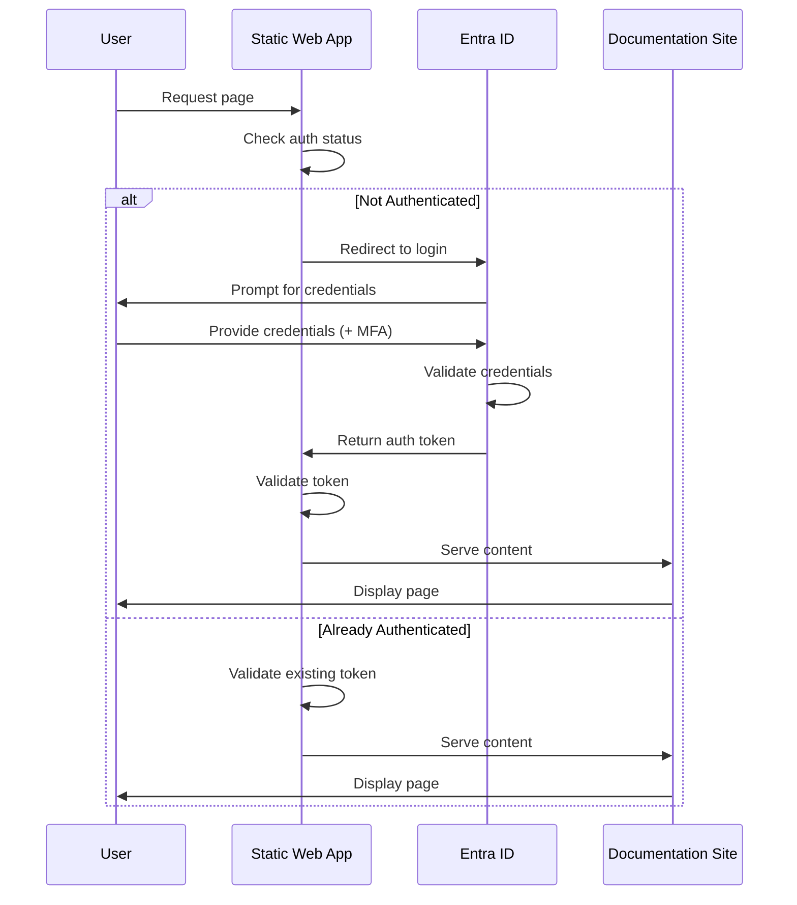

# Security Guide - Azure Static Web App with Entra ID

This document outlines the security architecture, best practices, and considerations for the Wiki Docs Static Web App deployment.

## Table of Contents

- [Security Architecture](#security-architecture)
- [Authentication & Authorization](#authentication--authorization)
- [Network Security](#network-security)
- [Secret Management](#secret-management)
- [Compliance & Governance](#compliance--governance)
- [Security Monitoring](#security-monitoring)
- [Incident Response](#incident-response)
- [Security Checklist](#security-checklist)

## Security Architecture

### Defense in Depth

Our security implementation follows a defense-in-depth strategy with multiple layers:

```
┌─────────────────────────────────────────────────────────┐
│ Layer 1: Network Security (HTTPS/TLS, CDN)            │
├─────────────────────────────────────────────────────────┤
│ Layer 2: Authentication (Entra ID)                    │
├─────────────────────────────────────────────────────────┤
│ Layer 3: Authorization (Route Protection)             │
├─────────────────────────────────────────────────────────┤
│ Layer 4: Application Security (Headers, CSP)          │
├─────────────────────────────────────────────────────────┤
│ Layer 5: Infrastructure Security (Azure RBAC)         │
└─────────────────────────────────────────────────────────┘
```

### Security Boundaries

1. **Perimeter**: Azure Front Door CDN with DDoS protection
2. **Identity**: Entra ID authentication gateway
3. **Application**: Static Web App with enforced authentication
4. **Data**: No persistent data storage (stateless documentation)
5. **Management**: Azure RBAC for infrastructure management

## Authentication & Authorization

### Entra ID Integration

#### Authentication Flow



#### Token Management

- **Token Type**: ID tokens and access tokens (OAuth 2.0 / OpenID Connect)
- **Token Lifetime**: Configured in Entra ID (default: 1 hour)
- **Refresh Mechanism**: Automatic refresh via Entra ID
- **Token Storage**: Secure HTTP-only cookies managed by Static Web Apps
- **Token Validation**: Server-side validation on every request

#### API Permissions

Minimum required Microsoft Graph permissions:

| Permission | Type | Purpose | Justification |
|------------|------|---------|---------------|
| `User.Read` | Delegated | Read user profile | Basic user identity |
| `openid` | Delegated | OpenID Connect | Authentication protocol |
| `profile` | Delegated | Basic profile info | User identification |
| `email` | Delegated | Email address | User contact info |

**Admin Consent**: Required for organizational use (granted during setup).

### Authorization Rules

#### Route Protection

All routes require authentication except auth endpoints:

```json
{
  "routes": [
    {
      "route": "/*",
      "allowedRoles": ["authenticated"]
    },
    {
      "route": "/.auth/*",
      "allowedRoles": ["anonymous"]
    }
  ]
}
```

#### Role-Based Access (Optional Enhancement)

To implement role-based access:

1. **Define custom roles** in `staticwebapp.config.json`:
   ```json
   {
     "routes": [
       {
         "route": "/admin/*",
         "allowedRoles": ["administrator"]
       }
     ]
   }
   ```

2. **Assign roles** via Azure Portal or API

3. **Map Entra ID groups** to Static Web App roles

## Network Security

### TLS/SSL

- **Enforced HTTPS**: All traffic redirected to HTTPS
- **TLS Version**: TLS 1.2 minimum (TLS 1.3 supported)
- **Certificate Management**: Automatic Let's Encrypt certificates
- **Certificate Renewal**: Automatic (no manual intervention)
- **HSTS**: HTTP Strict Transport Security enabled

### Content Delivery Network (CDN)

- **Azure Front Door**: Enterprise-grade CDN with Standard SKU
- **DDoS Protection**: Built-in DDoS protection
- **Web Application Firewall**: Available with upgrade to Premium SKU
- **Geo-Distribution**: Global edge nodes for low latency
- **Caching**: Configurable cache policies

### Security Headers

Implemented in `staticwebapp.config.json`:

```json
{
  "globalHeaders": {
    "X-Content-Type-Options": "nosniff",
    "X-Frame-Options": "DENY",
    "X-XSS-Protection": "1; mode=block",
    "Referrer-Policy": "strict-origin-when-cross-origin",
    "Permissions-Policy": "geolocation=(), microphone=(), camera=()"
  }
}
```

#### Header Explanations

- **X-Content-Type-Options**: Prevents MIME type sniffing
- **X-Frame-Options**: Prevents clickjacking attacks
- **X-XSS-Protection**: Enables browser XSS filter
- **Referrer-Policy**: Limits referrer information leakage
- **Permissions-Policy**: Restricts browser features

### Content Security Policy (CSP)

Recommended CSP header (add to `globalHeaders` if needed):

```
Content-Security-Policy: 
  default-src 'self'; 
  script-src 'self' 'unsafe-inline' 'unsafe-eval' https://unpkg.com; 
  style-src 'self' 'unsafe-inline'; 
  img-src 'self' data: https:; 
  font-src 'self' data:; 
  connect-src 'self' https://login.microsoftonline.com;
  frame-ancestors 'none';
```

## Secret Management

### GitHub Secrets/Variables

#### Variables (Non-Sensitive)

Stored as GitHub repository variables:

- `AZURE_TENANT_ID`
- `AZURE_SUBSCRIPTION_ID`
- `AZURE_RESOURCE_GROUP`
- `AZURE_STATIC_WEB_APP_NAME`
- `ENTRA_CLIENT_ID`

#### Secrets (Sensitive)

**DO NOT use GitHub secrets for this deployment** - instead use OIDC:

- `AZURE_CLIENT_ID` (OIDC principal, stored as variable)

**Never commit**:
- Deployment tokens
- Service principal credentials
- Private keys
- Certificates

### Azure Secret Management

- **Static Web App Deployment Token**: Retrieved dynamically via Azure CLI in workflow
- **Entra ID Client Secret**: Not used (using OpenID Connect flow)
- **Key Vault Integration**: Not required for this deployment (stateless app)

### Bicep Parameter Security

Sensitive parameters marked with `@secure()` decorator:

```bicep
@secure()
param entraClientId string
```

This ensures:
- Values not logged in deployment history
- Values not exposed in outputs
- Values encrypted in transit

## Compliance & Governance

### Azure Policy

Recommended policies for production:

```bash
# Require HTTPS
az policy assignment create \
  --name "require-https" \
  --policy "/providers/Microsoft.Authorization/policyDefinitions/a4af4a39-4135-47fb-b175-47fbdf85311d" \
  --scope "/subscriptions/<subscription-id>/resourceGroups/rg-wikidocs-prod"

# Require tags
az policy assignment create \
  --name "require-tags" \
  --policy "/providers/Microsoft.Authorization/policyDefinitions/96670d01-0a4d-4649-9c89-2d3abc0a5025" \
  --scope "/subscriptions/<subscription-id>/resourceGroups/rg-wikidocs-prod"
```

### Resource Tagging

Mandatory tags applied to all resources:

```json
{
  "Environment": "Production",
  "Application": "WikiDocs",
  "ManagedBy": "Bicep",
  "CostCenter": "Engineering",
  "Owner": "DevOps Team"
}
```

### Audit Logging

- **Azure Activity Log**: All infrastructure changes logged
- **Entra ID Sign-in Logs**: All authentication attempts logged
- **Static Web App Logs**: Access logs and errors (via Application Insights)

### Data Residency

- **Primary Region**: Central US
- **Data Storage**: No persistent user data stored
- **CDN Edge Locations**: Global (content cached at edge)
- **Authentication**: Entra ID (tenant-specific region)

## Security Monitoring

### Azure Monitor

#### Metrics to Monitor

1. **Authentication Failures**
   - Metric: Sign-in failures
   - Threshold: >10 failures/hour
   - Action: Alert security team

2. **HTTP Errors**
   - Metric: 4xx/5xx response codes
   - Threshold: >5% error rate
   - Action: Alert operations team

3. **Bandwidth Anomalies**
   - Metric: Bandwidth usage
   - Threshold: >2x normal usage
   - Action: Investigate for DDoS

4. **Deployment Failures**
   - Metric: Deployment status
   - Threshold: Any failure
   - Action: Alert DevOps team

#### Alert Configuration

```bash
# Create action group
az monitor action-group create \
  --name "wikidocs-alerts" \
  --resource-group "rg-wikidocs-prod" \
  --short-name "wikidocs" \
  --email-receiver name=devops email=devops@example.com

# Create alert rule for authentication failures
az monitor metrics alert create \
  --name "high-auth-failures" \
  --resource-group "rg-wikidocs-prod" \
  --scopes "/subscriptions/<sub-id>/resourceGroups/rg-wikidocs-prod/providers/Microsoft.Web/staticSites/<app-name>" \
  --condition "total AuthenticationErrors > 10" \
  --window-size 1h \
  --evaluation-frequency 5m \
  --action "wikidocs-alerts"
```

### Security Scanning

#### Dependency Scanning

- **Tool**: Dependabot (GitHub)
- **Frequency**: Daily
- **Action**: Automatic PRs for security updates

#### Static Code Analysis

- **Tool**: GitHub Advanced Security (Code Scanning)
- **Frequency**: On every push/PR
- **Action**: Block PR if critical vulnerabilities found

#### Secret Scanning

- **Tool**: GitHub Secret Scanning
- **Frequency**: On every push
- **Action**: Alert and revoke leaked secrets

### Threat Detection

Enable Microsoft Defender for Cloud:

```bash
az security pricing create \
  --name "AppServices" \
  --tier "Standard"
```

## Incident Response

### Security Incident Types

1. **Unauthorized Access Attempt**
2. **Authentication Bypass**
3. **DDoS Attack**
4. **Secret Leak**
5. **Infrastructure Compromise**

### Response Procedures

#### Incident: Unauthorized Access Attempt

**Detection**: Azure AD sign-in logs show repeated failures

**Steps**:
1. Identify the source IP/user
2. Review sign-in logs for patterns
3. Block IP if malicious (via Conditional Access)
4. Force password reset for compromised accounts
5. Review MFA configuration
6. Document incident

#### Incident: Secret Leak

**Detection**: GitHub secret scanning alert

**Steps**:
1. Immediately revoke the leaked secret
2. Rotate all related credentials
3. Review deployment logs for unauthorized access
4. Remove secret from Git history
5. Update documentation
6. Post-mortem review

#### Incident: DDoS Attack

**Detection**: Unusual bandwidth spike, slow response times

**Steps**:
1. Verify attack via Azure Monitor metrics
2. Azure Front Door automatically mitigates
3. Review WAF logs (if Premium SKU)
4. Consider IP blocking if source identified
5. Scale resources if needed (CDN handles most load)
6. Document attack patterns

### Rollback Procedures

If security incident requires rollback:

```bash
# Option 1: Redeploy previous infrastructure version
az deployment group create \
  --resource-group "rg-wikidocs-prod" \
  --template-file infrastructure/main.bicep \
  --parameters @parameters.json \
  --mode Complete

# Option 2: Disable the Static Web App temporarily
az staticwebapp disable \
  --name "<app-name>" \
  --resource-group "rg-wikidocs-prod"

# Option 3: Delete and recreate (nuclear option)
# Only if compromised beyond repair
```

## Security Checklist

### Pre-Deployment Security

- [ ] Entra ID app registration created with minimal permissions
- [ ] Admin consent granted by authorized administrator
- [ ] OIDC federation configured (no long-lived credentials)
- [ ] GitHub repository variables configured (no secrets in code)
- [ ] Bicep templates reviewed for security best practices
- [ ] Resource naming follows conventions (no sensitive info in names)

### Post-Deployment Security

- [ ] Verify entire site requires authentication
- [ ] Test with unauthenticated user (should be denied)
- [ ] Test with authenticated user (should have access)
- [ ] Verify security headers are applied
- [ ] Check TLS/SSL certificate is valid
- [ ] Confirm HTTPS enforcement works
- [ ] Review Azure Activity Log for deployment
- [ ] Enable Azure Monitor alerts
- [ ] Configure Defender for Cloud
- [ ] Set up cost alerts (for DDoS detection)

### Ongoing Security

- [ ] Review sign-in logs weekly
- [ ] Update dependencies monthly (Dependabot PRs)
- [ ] Review API permissions quarterly
- [ ] Rotate secrets/credentials per policy
- [ ] Test incident response procedures quarterly
- [ ] Review access controls quarterly
- [ ] Update documentation with any changes

### Compliance Requirements

- [ ] Document data residency for compliance
- [ ] Verify encryption in transit (TLS)
- [ ] Confirm audit logging is enabled
- [ ] Implement backup/recovery procedures
- [ ] Review and accept Azure shared responsibility model
- [ ] Document incident response procedures
- [ ] Conduct security awareness training for team

## Additional Resources

### Microsoft Security Documentation

- [Azure Static Web Apps Security](https://learn.microsoft.com/en-us/azure/static-web-apps/authentication-authorization)
- [Entra ID Best Practices](https://learn.microsoft.com/en-us/azure/active-directory/fundamentals/security-operations-introduction)
- [Azure Security Baseline](https://learn.microsoft.com/en-us/security/benchmark/azure/baselines/static-web-apps-security-baseline)

### Security Frameworks

- **CIS Azure Foundations Benchmark**: Security configuration best practices
- **NIST Cybersecurity Framework**: Comprehensive security approach
- **ISO 27001**: Information security management system

### Security Tools

- **Azure Security Center**: Unified security management
- **Microsoft Sentinel**: Security information and event management (SIEM)
- **Defender for Cloud Apps**: Cloud app security
- **Azure Policy**: Compliance and governance

## Security Contact

For security issues or questions:

- **Security Team**: security@example.com
- **DevOps Team**: devops@example.com
- **Emergency**: Follow incident response procedures

---

**Document Version**: 1.0.0  
**Last Updated**: 2026-01-14  
**Review Frequency**: Quarterly  
**Next Review**: 2026-04-14
